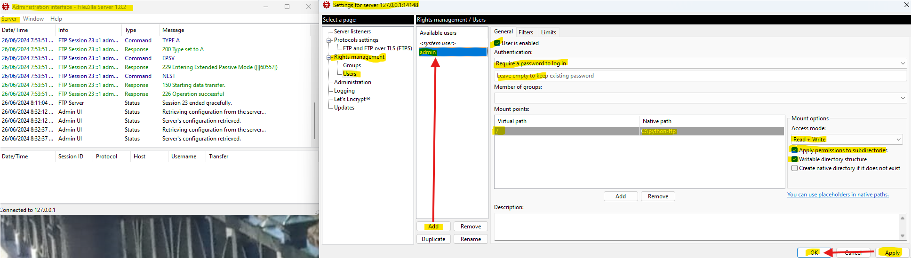
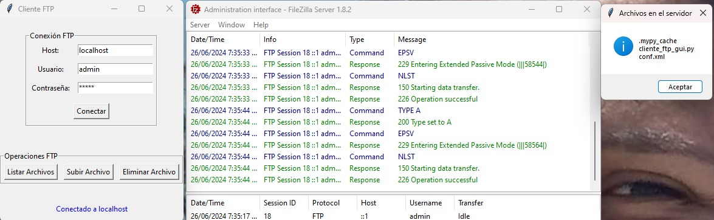
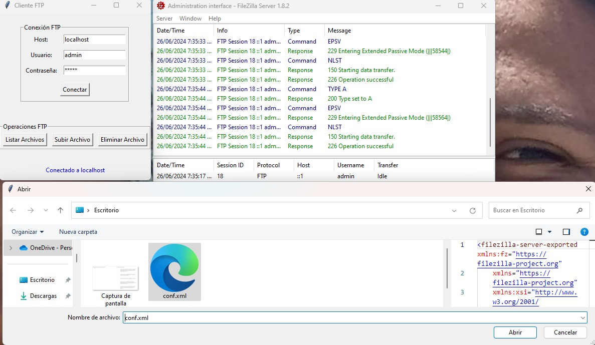
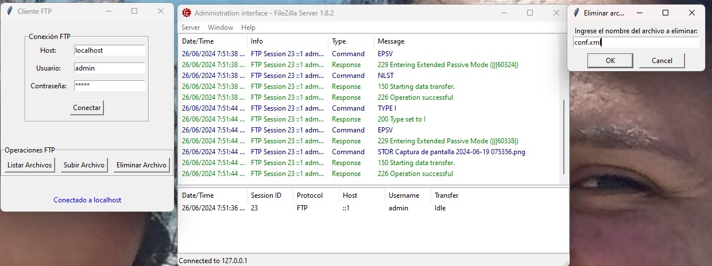

# FTP Client GUI - Execution Instructions

This program provides a Graphical User Interface (GUI) to interact with an FTP server using Python's `ftplib` library and the `tkinter` GUI toolkit.

## Prerequisites

- Python 3 installed on your system.
- Access to an FTP server with valid credentials.

## Steps to Run the Program

1. **Clone the Repository (Optional)**

   If you haven't downloaded the repository code, you can clone it using Git:

   ```bash
   git clone --recursive --depth=1 https://github.com/OMaciasd/ftp-client-gui.git --progress
   cd ftp-client-gui
   pip install tkinter
   python cliente_ftp_gui.py
   ```

## Steps to use the Program

A. **Connecting to the FTP Server (Mandatory)**

- Launch the application by running `cliente_ftp_gui.py`.
- Enter the FTP server `Host`, `Username`, and `Password`.
- Click on the "Conectar" button to establish a connection to the FTP server.

- Import the `conf.xml` file to the settings.



B. **Performing FTP Operations**

- **List Files:** Click on the `Listar Archivos` button to display a list of files on the FTP server.



- **Upload File:** Click on the `Subir Archivo` button to select a local file and upload it to the FTP server.



- **Delete File:** Click on the `Eliminar Archivo` button to delete a selected file from the FTP server.



C. **Closing the Application**

- Close the FTP client GUI application by clicking the `close window` button on the main window or using the appropriate key combination for your operating system.
